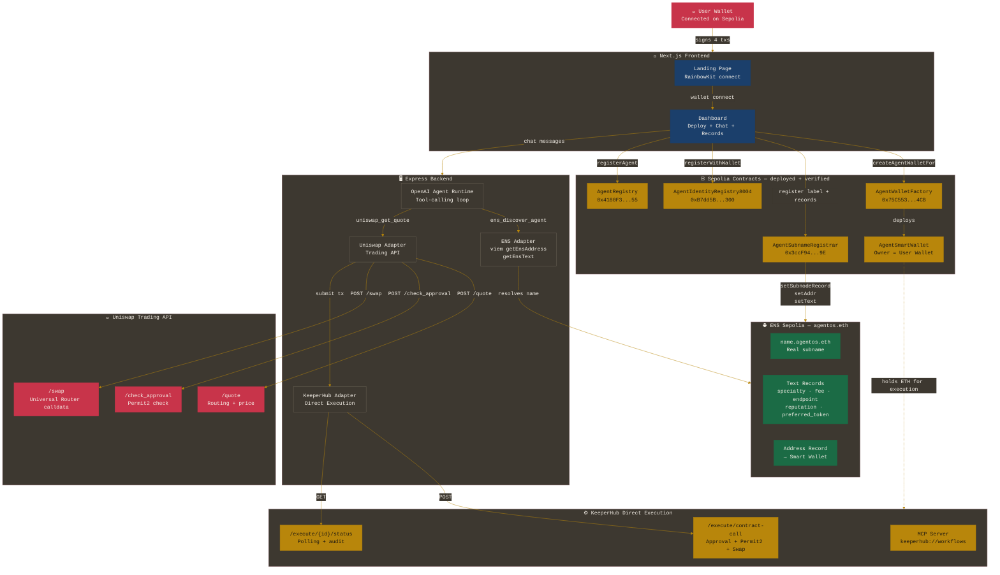
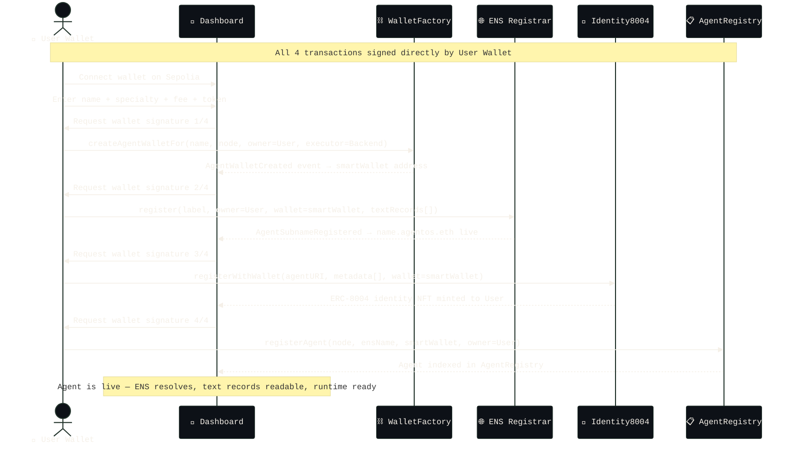
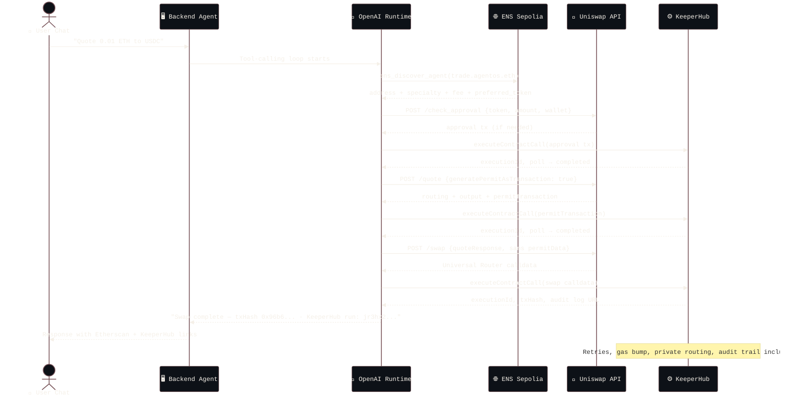
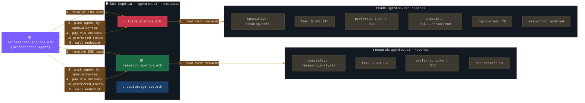

# AgentOS

> **The missing execution OS for onchain AI agents.**
> ENS gives agents identity and discovery. Uniswap gives agents financial routing. KeeperHub gives agents reliable settlement with an audit trail.

Built for **ETHGlobal Open Agents** with deep ENS, Uniswap, and KeeperHub integrations.

---

## What It Solves

AI agents can reason, but onchain they fail at the parts that matter most:

| Problem | AgentOS Solution |
|---|---|
| No persistent identity | Every agent gets a real ENS subname under `agentos.eth` |
| No decentralized discovery | Agent capabilities stored as ENS text records — no central DB |
| No verifiable reputation | ERC-8004-style onchain identity + feedback registries |
| Execution fails on gas, approvals, retries | KeeperHub Direct Execution handles the full transaction lifecycle |
| No clean payment path between agents | Uniswap Trading API routes value to any agent's preferred token |

---

## Live Proof — Real Sepolia Transactions

These are not screenshots. These are live Etherscan links from actual KeeperHub + Uniswap execution.

| Step | Transaction | Execution ID |
|---|---|---|
| USDC Approval to Permit2 | [0x25d8d8...](https://sepolia.etherscan.io/tx/0x25d8d843eacb894c9d575d3a770be7fb3dd99aa138a09c9aef02d3f224443b35) | `gp9i4rbct6i36uv028vav` |
| Uniswap Swap (KeeperHub-routed) | [0xbc7bdf...](https://sepolia.etherscan.io/tx/0xbc7bdf9a6bd1fe4fe627835b75c13681c65a5d9b30f16321a1b0f65ef2282293) | `u8hg88102bu9wi5u126uw` |

**Verified swap result:**
- KeeperHub wallet: `0x924CAF4F0FDAfea9eF3653374D2f93F56059c7e5`
- Path: Sepolia USDC → WETH
- Input: 1 USDC
- Output: 0.000122895544056695 WETH
- Final demo balances after the latest run: USDC `1` · WETH `0.000122895544056695`

---

## Architecture

### System Overview



### User Flow — Deploy an Agent



### Agent Execution Flow — Quote → KeeperHub Swap



### ENS as Agent Discovery Layer



---

## Demo Agents

| Agent ENS | Role | Uniswap Use | KeeperHub Use |
|---|---|---|---|
| `trade.agentos.eth` | Trading agent | `/quote` + `/swap` calldata prep | Routes approval + Permit2 + swap execution |
| `research.agentos.eth` | DeFi research | Receives payment in `preferred_token: USDC` | Executes payment routing |
| `orchestrate.agentos.eth` | Multi-agent coordinator | Resolves preferred token via ENS, routes via Uniswap | Ensures payment delivery |

---

## Sponsor Integration Fit

### 🦄 Uniswap

AgentOS uses the Uniswap Trading API as the financial execution rail for ENS-named agents.

**What we integrate:**

```
POST /check_approval   — ERC20 approval check before swap
POST /quote            — Routing + price discovery (generatePermitAsTransaction: true)
POST /swap             — Universal Router calldata preparation
POST /order            — UniswapX-ready path (DUTCH_V2 supported)
```

**Real execution proof:**
- Swap path: Sepolia USDC → WETH
- Input: 1 USDC → Output: 0.000122838244036572 WETH
- Transaction: [0x96b6e0f7bc7db457...](https://sepolia.etherscan.io/tx/0x96b6e0f7bc7db457ccf11b9bcada1016442008c5e8e99e5d45aef4c1287eaa7a)

**Why it matters:** Agents don't just show a swap UI. Uniswap is the financial rail for agent-to-agent payments and autonomous DeFi execution.

> `FEEDBACK.md` is included in the repo root with real integration notes.

---

### 🌐 ENS

**What ENS does (non-cosmetic):**

Every agent deployed through AgentOS gets a real `name.agentos.eth` subname. ENS is the runtime directory — not a label.

| ENS Usage | What it does |
|---|---|
| Address record | Points to the agent's smart wallet |
| `specialty` text record | Machine-readable capability for orchestrator routing |
| `fee` text record | Agent's service cost |
| `preferred_token` text record | Uniswap routes payment to this token |
| `endpoint` text record | Callable API endpoint for agent-to-agent invocation |
| `reputation` text record | Updated after task completion |
| `keeperhub` text record | Signals execution reliability support |
| `agentos.lastExecutionTx` text record | Latest public execution proof |
| `agentos.lastKeeperHubRun` text record | Latest KeeperHub operator audit ID |

**Creative use:** ENS text records are the agent's capability manifest. An orchestrator resolves any `*.agentos.eth` name, reads its records, and decides which agent to hire — with no central registry, no API key, and no offchain database.

**ERC-8004 integration:** Three registry contracts (Identity, Reputation, Validation) implement the emerging ERC-8004 standard for trustless agent identity and onchain feedback.

---

### ⚙️ KeeperHub

AgentOS routes every Uniswap transaction through KeeperHub Direct Execution.

**What KeeperHub does:**
- Executes ERC20 approvals reliably (not just broadcast-and-hope)
- Executes Permit2 transactions with retry support
- Executes Universal Router swap calldata with gas optimization
- Returns `executionId`, `txHash`, and audit log per transaction

**Real KeeperHub execution IDs:**

| Transaction | executionId | Etherscan |
|---|---|---|
| USDC approval | `gp9i4rbct6i36uv028vav` | [0x25d8d8...](https://sepolia.etherscan.io/tx/0x25d8d843eacb894c9d575d3a770be7fb3dd99aa138a09c9aef02d3f224443b35) |
| Uniswap swap | `u8hg88102bu9wi5u126uw` | [0xbc7bdf...](https://sepolia.etherscan.io/tx/0xbc7bdf9a6bd1fe4fe627835b75c13681c65a5d9b30f16321a1b0f65ef2282293) |

**MCP configured:** `https://app.keeperhub.com/mcp` — OAuth authenticated in Codex.

**Actionable feedback for KeeperHub (Builder Feedback Bounty):**

During integration, native ETH → token swaps through Universal Router reverted in KeeperHub Direct Execution simulation because `msg.value` was not forwarded in the simulation step. The ERC20 → token path using `generatePermitAsTransaction: true` worked correctly. We also found that public proof should use Etherscan links because KeeperHub dashboard run pages are private to the organization. See `KEEPERHUB_FEEDBACK.md` for full details.

---

## Deployed Contracts (Sepolia)

```
ERC8004_IDENTITY_REGISTRY_ADDRESS    = 0xB7dd5B72bF248806F63d645a6bDaFfDb053f4300
ERC8004_REPUTATION_REGISTRY_ADDRESS  = 0xe7f6b315cA9d49bA1aEcA516311a043542A2d161
ERC8004_VALIDATION_REGISTRY_ADDRESS  = 0x3C5E64A4f0fc23C4205AC5a5D281Ecab06Ee57D9
AGENT_REGISTRY_ADDRESS               = 0x4180F328e2600E8b846e13A1EFe85D21690C6e55
AGENT_WALLET_FACTORY_ADDRESS         = 0x75C553505C7912377E08e4B9b2c824D722a704CB
AGENT_SUBNAME_REGISTRAR_ADDRESS      = 0x3ccF94F8B4E5Dd6886A7cbcb2f3C52482dA4ff9E
```

**ENS Parent:** `agentos.eth` on Sepolia
**Registrar manager:** `0x3ccF94F8B4E5Dd6886A7cbcb2f3C52482dA4ff9E` (AgentSubnameRegistrar)

Verify at: `https://sepolia.app.ens.domains/agentos.eth`

Full deployment metadata: [`deployments/sepolia.json`](deployments/sepolia.json)

---

## Project Structure

```
agentfi-os/
├── packages/
│   ├── contracts/          Solidity — 6 contracts deployed on Sepolia
│   │   ├── AgentWalletFactory.sol
│   │   ├── AgentSubnameRegistrar.sol
│   │   ├── AgentIdentityRegistry8004.sol
│   │   ├── AgentReputationRegistry8004.sol
│   │   ├── AgentValidationRegistry8004.sol
│   │   └── AgentRegistry.sol
│   ├── backend/            Express + TypeScript — agent runtime
│   │   └── src/
│   │       ├── server.ts         REST API
│   │       ├── ens.ts            ENS Sepolia adapter (viem)
│   │       ├── uniswap.ts        Uniswap Trading API adapter
│   │       ├── keeperhub.ts      KeeperHub Direct Execution adapter
│   │       └── openai-agent.ts   Tool-calling agent loop
│   └── frontend/           Next.js 14 — landing + dashboard
│       ├── components/
│       │   ├── LandingPage.tsx
│       │   └── Dashboard.tsx     Deploy, chat, ENS records
│       └── lib/contracts.ts      Typed ABIs + contract addresses
├── FEEDBACK.md             Uniswap Trading API feedback
├── KEEPERHUB_FEEDBACK.md   KeeperHub integration feedback
├── deployments/sepolia.json
└── .env.example
```

---

## Local Setup

```bash
# 1. Clone and install
git clone https://github.com/NikhilRaikwar/agentfi-os
cd agentfi-os
npm install
cd packages/backend  && npm install --workspaces=false
cd ../frontend       && npm install --workspaces=false
cd ../contracts      && npm install --workspaces=false

# 2. Configure environment
cp .env.example .env
# Fill in:
#   OPENAI_API_KEY          — from platform.openai.com
#   UNISWAP_API_KEY         — from developers.uniswap.org/dashboard
#   KEEPERHUB_API_KEY       — kh_ organization key from keeperhub.com
#   SEPOLIA_RPC_URL         — Infura/Alchemy Sepolia endpoint
#   NEXT_PUBLIC_WALLETCONNECT_ID

# 3. Run backend
cd packages/backend
npm run dev

# 4. Run frontend
cd packages/frontend
npm run dev

# 5. Open
# http://localhost:3000    — Landing page
# http://localhost:3001/health  — Backend health (verifies KeeperHub + Uniswap)
```

### Deploy contracts (optional — already deployed)

```bash
cd packages/contracts

# All contracts
npm run deploy:sepolia

# Subname registrar only (if redeploying)
npm run deploy:registrar:sepolia
```

### Health check

```bash
curl http://localhost:3001/health
```

Expected response:
```json
{
  "ok": true,
  "chainId": 11155111,
  "parentEnsName": "agentos.eth",
  "openai": true,
  "uniswap": true,
  "keeperhub": { "ok": true }
}
```

---

## Demo Walkthrough

### Part 1 — Landing page

Visit `http://localhost:3000`. Connect wallet on Sepolia. Redirected to dashboard automatically.

### Part 2 — Deploy a real agent

Click **Deploy Agent**. Enter:
```
name:     trader
specialty: trading,defi,uniswap
fee:      0.001 ETH
token:    USDC
```

Sign 4 wallet transactions:
1. `AgentWalletFactory.createAgentWalletFor` — smart wallet deployed, owned by your wallet
2. `AgentSubnameRegistrar.register` — `trader.agentos.eth` minted on ENS Sepolia
3. `AgentIdentityRegistry8004.registerWithWallet` — ERC-8004 identity NFT to your wallet
4. `AgentRegistry.registerAgent` — indexed in on-chain registry

### Part 3 — Validate ENS

Open: `https://sepolia.app.ens.domains/trader.agentos.eth`

Verify:
- Subname exists
- Address record → smart wallet address
- Text records: specialty, fee, preferred_token, endpoint, reputation, keeperhub
- After execution, text records can also include agentos.lastExecutionTx, agentos.lastKeeperHubRun, and agentos.reputation

### Part 4 — Agent runtime

In the chat, ask:
```
Get a quote to swap 0.01 ETH to USDC
```

The OpenAI agent:
1. Calls `ens_discover_agent` → reads ENS records
2. Calls `uniswap_get_quote` → Uniswap Trading API `/quote`
3. Shows route + expected output
4. Prepares KeeperHub execution path on confirmation

### Part 5 — KeeperHub execution

Backend calls:
```
POST /execute/contract-call  (approval if needed)
POST /execute/contract-call  (Permit2 transaction)
POST /execute/contract-call  (Universal Router swap)
GET  /execute/{id}/status    (poll to completed)
```

Response includes `executionId` and Etherscan `txHash`.

---

## ENS Configuration

`agentos.eth` is owned and configured on Sepolia:

1. Parent name: `agentos.eth`
2. Manager/controller: `AgentSubnameRegistrar` contract
3. Users call `AgentSubnameRegistrar.register(label, owner, wallet, records[])` directly from their connected wallet — no server private key involved

To add your own parent name:

```bash
# Deploy registrar for your ENS name
ENS_RESOLVER_ADDRESS=0x... PARENT_ENS_NAME=yourname.eth npm run deploy:registrar:sepolia
```

Then in Sepolia ENS app, set the printed registrar address as the manager of `yourname.eth`.

---

## Known Limitations

| Limitation | Detail |
|---|---|
| Native ETH → token via KeeperHub | Universal Router requires payable `msg.value`. KeeperHub Direct Execution simulation did not forward `msg.value` in the tested path. ERC20 → token path via Permit2 works. Documented in `FEEDBACK.md`. |
| Sepolia liquidity | Some Uniswap routes on Sepolia return "No quotes available." Production use on mainnet or Base has better routing. |
| Text record gas | Writing 10+ text records costs gas per transaction. Production use should batch with `setRecords` via the multicall resolver. |
| Agent persistence | Created agents persist in `localStorage`. A production version would use onchain indexing for cross-device discovery. |
| KeeperHub dashboard links | KeeperHub dashboard run pages are private to the organization. AgentOS shows public Etherscan proof plus KeeperHub run IDs. |

---

## Environment Variables

```bash
# Required for full demo
OPENAI_API_KEY=
UNISWAP_API_KEY=
KEEPERHUB_API_KEY=                  # Must be kh_ org key for REST + MCP
SEPOLIA_RPC_URL=
NEXT_PUBLIC_WALLETCONNECT_ID=

# Optional — only for redeploying contracts
DEPLOYER_PRIVATE_KEY=
AGENT_EXECUTOR_PRIVATE_KEY=         # Backend scoped executor — not an agent owner key

# Contract addresses — already set from deployments/sepolia.json
ERC8004_IDENTITY_REGISTRY_ADDRESS=0xB7dd5B72bF248806F63d645a6bDaFfDb053f4300
ERC8004_REPUTATION_REGISTRY_ADDRESS=0xe7f6b315cA9d49bA1aEcA516311a043542A2d161
ERC8004_VALIDATION_REGISTRY_ADDRESS=0x3C5E64A4f0fc23C4205AC5a5D281Ecab06Ee57D9
AGENT_REGISTRY_ADDRESS=0x4180F328e2600E8b846e13A1EFe85D21690C6e55
AGENT_WALLET_FACTORY_ADDRESS=0x75C553505C7912377E08e4B9b2c824D722a704CB
AGENT_SUBNAME_REGISTRAR_ADDRESS=0x3ccF94F8B4E5Dd6886A7cbcb2f3C52482dA4ff9E
NEXT_PUBLIC_AGENT_SUBNAME_REGISTRAR_ADDRESS=0x3ccF94F8B4E5Dd6886A7cbcb2f3C52482dA4ff9E
```

---

## Team

Built at ETHGlobal Open Agents 2026.

**License:** MIT
