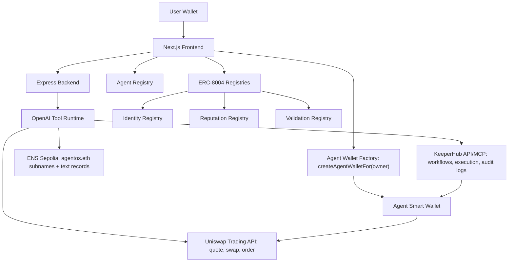

# AgentFi OS

AgentFi OS is the missing OS layer for onchain AI agents: ENS gives every agent a name, metadata, and reputation; Uniswap gives agents transaction and payment rails; KeeperHub gives execution reliability.

Built for ETHGlobal Open Agents with `agentos.eth` as the agent namespace.

## What It Does

- Deploys ENS-named agents such as `trade.agentos.eth`, `research.agentos.eth`, and `orchestrate.agentos.eth`.
- Stores agent capabilities, fees, preferred token, model, task count, and reputation in ENS text records.
- Gives each agent a revocable smart wallet owned by the connected user wallet, not a server deployer key.
- Uses OpenAI tool calling for agent reasoning.
- Uses the Uniswap Trading API for quotes, swaps, and agent-to-agent payments.
- Uses KeeperHub for workflow execution, retries, gas optimization, and audit trails.
- Adds ERC-8004-style identity, reputation, and validation registries for trustless agent discovery.

## Architecture



## Demo Agents

| Agent | Role | ENS Usage | Uniswap Usage |
| --- | --- | --- | --- |
| `trade.agentos.eth` | Trading agent | Capability + reputation records | Quotes and prepares swaps |
| `research.agentos.eth` | DeFi research agent | Discoverable service profile | Receives payment in preferred token |
| `orchestrate.agentos.eth` | Multi-agent coordinator | Resolves and hires agents | Routes agent payments |

## Sepolia Deployment

```text
ERC8004_IDENTITY_REGISTRY_ADDRESS=0xB7dd5B72bF248806F63d645a6bDaFfDb053f4300
ERC8004_REPUTATION_REGISTRY_ADDRESS=0xe7f6b315cA9d49bA1aEcA516311a043542A2d161
ERC8004_VALIDATION_REGISTRY_ADDRESS=0x3C5E64A4f0fc23C4205AC5a5D281Ecab06Ee57D9
AGENT_REGISTRY_ADDRESS=0x4180F328e2600E8b846e13A1EFe85D21690C6e55
AGENT_WALLET_FACTORY_ADDRESS=0x75C553505C7912377E08e4B9b2c824D722a704CB
```

Deployment metadata is also stored in [`deployments/sepolia.json`](deployments/sepolia.json).

## Project Structure

```text
packages/frontend   Next.js landing page and dashboard
packages/backend    Express API, OpenAI tools, ENS, Uniswap, KeeperHub adapters
packages/contracts  Agent smart wallets, registry, ERC-8004-style contracts
```

## Environment

Copy `.env.example` to `.env` and fill the values.

Required for the full demo:

- `OPENAI_API_KEY`
- `UNISWAP_API_KEY`
- `KEEPERHUB_API_KEY` with `kh_` organization-key prefix
- `SEPOLIA_RPC_URL`
- `NEXT_PUBLIC_WALLETCONNECT_ID`
- `DEPLOYER_PRIVATE_KEY` only when redeploying contracts
- `AGENT_EXECUTOR_PRIVATE_KEY` for the backend executor address allowed by agent smart wallets

Normal users do not need to expose private keys to the server. The connected wallet signs agent wallet creation, ERC-8004 identity registration, and AgentFi registry registration directly from the frontend.

Never commit `.env`.

## Run Locally

Install dependencies in each package if needed:

```bash
npm install
cd packages/backend && npm install --workspaces=false
cd ../frontend && npm install --workspaces=false
cd ../contracts && npm install --workspaces=false
```

Build everything:

```bash
npm run build
```

Run backend:

```bash
cd packages/backend
npm run dev
```

Run frontend:

```bash
cd packages/frontend
npm run dev
```

Open:

```text
http://localhost:3000
http://localhost:3001/health
```

## Sponsor Alignment

**Uniswap:** real Trading API integration for quote/swap/order flows and agent-to-agent payments.

**ENS:** subnames, text records, reputation, and agent discovery without a central database.

**KeeperHub:** execution layer for workflows, transaction reliability, status, logs, and automation.

**ERC-8004:** onchain identity, feedback, and validation registries for trustless AI agents.
