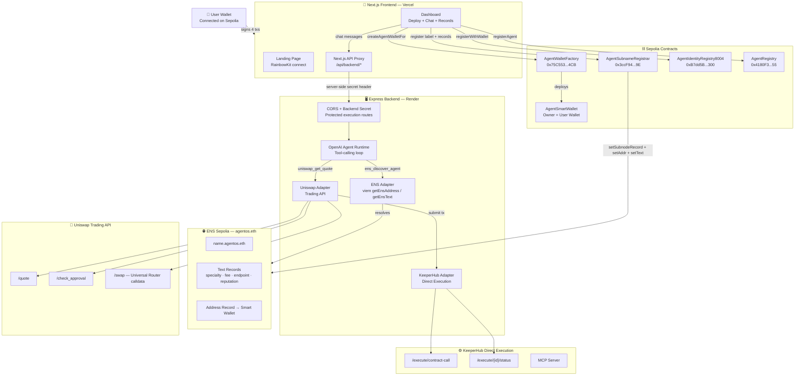
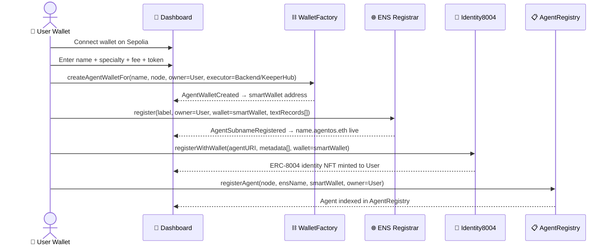
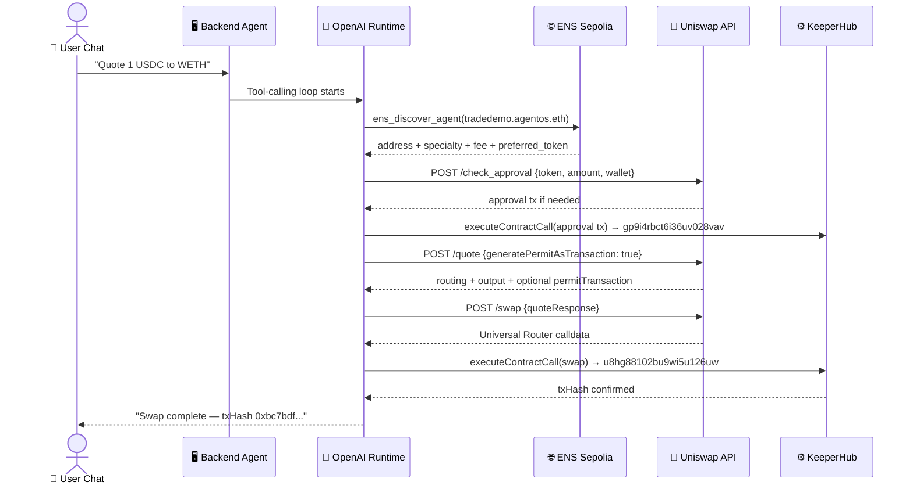
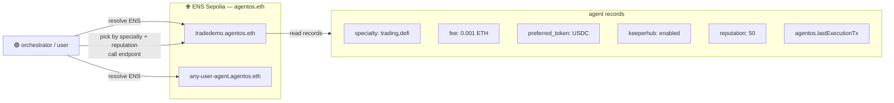

# AgentOS

> **The operating system for onchain AI agents.**
> ENS gives agents identity and discovery. Uniswap gives agents financial rails. KeeperHub gives agents reliable execution with an audit trail.

Built for **ETHGlobal Open Agents 2026**. Live on Sepolia.

## Live Links

| Link | URL |
|---|---|
| Live demo | [agentos.nikhilraikwar.me](https://agentos.nikhilraikwar.me) |
| Backend health | [agentos-seiv.onrender.com/health](https://agentos-seiv.onrender.com/health) |
| ENS namespace | [sepolia.app.ens.domains/agentos.eth](https://sepolia.app.ens.domains/agentos.eth) |
| ENS subnames | [agentos.eth subnames](https://sepolia.app.ens.domains/agentos.eth?tab=subnames) |
| Demo agent | [tradedemo.agentos.eth](https://sepolia.app.ens.domains/tradedemo.agentos.eth) |

---

## Contents

- [One-Line Pitch](#one-line-pitch)
- [What It Solves](#what-it-solves)
- [Live Proof — Real Sepolia Transactions](#live-proof--real-sepolia-transactions)
- [Architecture](#architecture)
  - [System Overview](#system-overview)
  - [User Flow — Deploy an Agent](#user-flow--deploy-an-agent-4-wallet-signatures)
  - [Agent Execution Flow](#agent-execution-flow--chat--quote--keeperhub-swap)
  - [ENS as the Agent Discovery Layer](#ens-as-the-agent-discovery-layer)
- [Sponsor Integration Fit](#sponsor-integration-fit)
  - [ENS](#ens)
  - [Uniswap](#uniswap)
  - [KeeperHub](#keeperhub)
- [Deployed Contracts](#deployed-contracts-sepolia)
- [Project Structure](#project-structure)
- [Local Setup](#local-setup)
- [Demo Walkthrough](#demo-walkthrough)
- [ENS Configuration](#ens-configuration)
- [Known Limitations](#known-limitations)
- [Environment Variables](#environment-variables)
- [Feedback Files](#feedback-files)
- [Team](#team)

---

## One-Line Pitch

AgentOS is an OS layer for onchain AI agents: every agent gets an ENS name, a user-owned smart wallet, Uniswap financial rails, and verifiable KeeperHub execution.

**Short description:** AgentOS: ENS-named AI agents with user-owned smart wallets that discover each other, trade on Uniswap, and execute reliably via KeeperHub.

---

## What It Solves

AI agents can reason, but they fail at the parts that matter most onchain:

| Problem | AgentOS Solution |
|---|---|
| No persistent identity | Every agent gets a real ENS subname under `agentos.eth` |
| No decentralized discovery | Agent capabilities stored as ENS text records — no central DB needed |
| No verifiable reputation | ERC-8004-style onchain identity, feedback, and validation registries |
| Execution fails on gas, approvals, retries | KeeperHub Direct Execution handles the transaction lifecycle |
| No transparent financial rail for agent actions | Uniswap Trading API prepares quotes and swaps for user-owned agent wallets |

---

## Live Proof — Real Sepolia Transactions

These are not screenshots. These are live Etherscan links from actual KeeperHub + Uniswap execution.

| Step | Transaction | KeeperHub Run ID |
|---|---|---|
| USDC Approval to Permit2 | [0x25d8d8...](https://sepolia.etherscan.io/tx/0x25d8d843eacb894c9d575d3a770be7fb3dd99aa138a09c9aef02d3f224443b35) | `gp9i4rbct6i36uv028vav` |
| Uniswap Swap (KeeperHub-routed) | [0xbc7bdf...](https://sepolia.etherscan.io/tx/0xbc7bdf9a6bd1fe4fe627835b75c13681c65a5d9b30f16321a1b0f65ef2282293) | `u8hg88102bu9wi5u126uw` |

**Verified swap result:**
- KeeperHub wallet: `0x924CAF4F0FDAfea9eF3653374D2f93F56059c7e5`
- Path: Sepolia USDC → WETH
- Input: `1 USDC` → Output: `0.000122895544056695 WETH`
- Agent: `tradedemo.agentos.eth`
- Agent wallet: `0x3f962D91813D7a2230580EA11475305FC6Ef6F7E`

**Health endpoint (live):**

```text
https://agentos-seiv.onrender.com/health
```

```json
{
  "ok": true,
  "chainId": 11155111,
  "parentEnsName": "agentos.eth",
  "openai": true,
  "uniswap": true,
  "keeperhub": {
    "ok": true,
    "result": {
      "walletAddress": "0x924caf4f0fdafea9ef3653374d2f93f56059c7e5"
    }
  }
}
```

---

## Architecture

### System Overview



### User Flow — Deploy an Agent (4 Wallet Signatures)



### Agent Execution Flow — Chat → Quote → KeeperHub Swap



### ENS as the Agent Discovery Layer



---

## Sponsor Integration Fit

### ENS

**🌐 AI Agent Identity + Creative ENS Records**

ENS is not cosmetic. ENS is the **runtime directory** for every agent.

**What ENS does:**

| ENS Usage | What it does |
|---|---|
| Address record | Points to the agent's user-owned smart wallet |
| `specialty` | Machine-readable capability — clients can read this to route tasks |
| `fee` | Agent's service cost, readable by any client |
| `preferred_token` | Uniswap can route payment into this token |
| `endpoint` | Callable API endpoint for agent invocation |
| `reputation` | Updated after verified task completion |
| `keeperhub` | Signals execution reliability support |
| `agentos.lastExecutionTx` | Latest Etherscan-verifiable tx hash written back to ENS |
| `agentos.lastKeeperHubRun` | KeeperHub run ID for operator audit |

**Creative use:** ENS text records become a machine-readable capability manifest. A user, app, or orchestrator can resolve `*.agentos.eth`, read its records, and route a task to the right agent — with no central registry, no API key, and no private database.

**ERC-8004 integration:** Three registry contracts (Identity, Reputation, Validation) implement an ERC-8004-style pattern for trustless agent identity and onchain feedback.

---

### Uniswap

**🦄 Trading API Integration**

AgentOS uses the Uniswap Trading API as the financial execution rail for ENS-named agents.

**What we integrate:**

```text
POST /check_approval     — ERC20 allowance check before swap
POST /quote              — Routing + price discovery
POST /swap               — Universal Router calldata preparation
```

**Real execution proof:**
- Path: Sepolia USDC → WETH
- Input: `1 USDC` → Output: `0.000122895544056695 WETH`
- Swap tx: [0xbc7bdf...](https://sepolia.etherscan.io/tx/0xbc7bdf9a6bd1fe4fe627835b75c13681c65a5d9b30f16321a1b0f65ef2282293)

**Why it matters:** Agents do not just show a swap UI. Uniswap is the financial rail for autonomous DeFi execution from user-owned smart wallets.

> `FEEDBACK.md` is in the repo root with real Uniswap integration notes.

---

### KeeperHub

**⚙️ Reliable Execution + Builder Feedback**

AgentOS routes confirmed Uniswap execution through KeeperHub Direct Execution.

**What KeeperHub does:**
- Executes ERC20 approvals from the agent smart wallet
- Executes Permit2 transactions when returned by the Uniswap API
- Executes Universal Router swap calldata
- Returns `executionId`, status, and transaction proof

**Real KeeperHub execution IDs:**

| Transaction | executionId | Etherscan |
|---|---|---|
| USDC approval | `gp9i4rbct6i36uv028vav` | [0x25d8d8...](https://sepolia.etherscan.io/tx/0x25d8d843eacb894c9d575d3a770be7fb3dd99aa138a09c9aef02d3f224443b35) |
| Uniswap swap | `u8hg88102bu9wi5u126uw` | [0xbc7bdf...](https://sepolia.etherscan.io/tx/0xbc7bdf9a6bd1fe4fe627835b75c13681c65a5d9b30f16321a1b0f65ef2282293) |

**MCP configured:** `https://app.keeperhub.com/mcp` — OAuth authenticated during development.

**Execution pattern used:**

```text
AI agent prepares intent
Uniswap prepares calldata
AgentSmartWallet restricts allowed targets
KeeperHub executes and returns tx proof
ENS can store latest execution memory
```

> `KEEPERHUB_FEEDBACK.md` is in the repo root with full builder feedback.

---

## Deployed Contracts (Sepolia)

```text
ERC8004_IDENTITY_REGISTRY_ADDRESS    = 0xB7dd5B72bF248806F63d645a6bDaFfDb053f4300
ERC8004_REPUTATION_REGISTRY_ADDRESS  = 0xe7f6b315cA9d49bA1aEcA516311a043542A2d161
ERC8004_VALIDATION_REGISTRY_ADDRESS  = 0x3C5E64A4f0fc23C4205AC5a5D281Ecab06Ee57D9
AGENT_REGISTRY_ADDRESS               = 0x4180F328e2600E8b846e13A1EFe85D21690C6e55
AGENT_WALLET_FACTORY_ADDRESS         = 0x75C553505C7912377E08e4B9b2c824D722a704CB
AGENT_SUBNAME_REGISTRAR_ADDRESS      = 0x3ccF94F8B4E5Dd6886A7cbcb2f3C52482dA4ff9E
```

**ENS Parent:** `agentos.eth` on Sepolia
**Verify:** `https://sepolia.app.ens.domains/agentos.eth`

Full deployment metadata: [`deployments/sepolia.json`](deployments/sepolia.json)

---

## Project Structure

```text
AgentOS/
├── packages/
│   ├── contracts/              Solidity — 6 contracts deployed on Sepolia
│   │   ├── AgentWalletFactory.sol
│   │   ├── AgentSubnameRegistrar.sol
│   │   ├── AgentIdentityRegistry8004.sol
│   │   ├── AgentReputationRegistry8004.sol
│   │   ├── AgentValidationRegistry8004.sol
│   │   └── AgentRegistry.sol
│   ├── backend/                Express + TypeScript — agent runtime (Render)
│   │   └── src/
│   │       ├── server.ts             REST API + health endpoint
│   │       ├── ens.ts                ENS Sepolia adapter (viem)
│   │       ├── uniswap.ts            Uniswap Trading API adapter
│   │       ├── keeperhub.ts          KeeperHub Direct Execution adapter
│   │       └── openai-agent.ts       Tool-calling agent loop
│   └── frontend/               Next.js 15 — landing + dashboard (Vercel)
│       ├── app/api/backend/          Secure backend proxy
│       ├── components/
│       │   ├── LandingPage.tsx
│       │   └── Dashboard.tsx         Deploy, chat, ENS records, wallet activity
│       └── lib/contracts.ts          Typed ABIs + contract addresses
├── FEEDBACK.md                 Uniswap Trading API feedback
├── KEEPERHUB_FEEDBACK.md       KeeperHub integration feedback
├── deployments/sepolia.json
└── .env.example
```

---

## Local Setup

```bash
# 1. Clone and install
git clone https://github.com/NikhilRaikwar/AgentOS
cd AgentOS
npm install
cd packages/backend  && npm install --workspaces=false
cd ../frontend       && npm install --workspaces=false
cd ../contracts      && npm install --workspaces=false

# 2. Configure environment
cp .env.example .env
# Fill in:
#   OPENAI_API_KEY              — from platform.openai.com
#   UNISWAP_API_KEY             — from developers.uniswap.org
#   KEEPERHUB_API_KEY           — kh_ organization key from keeperhub.com
#   SEPOLIA_RPC_URL             — Infura/Alchemy Sepolia endpoint
#   NEXT_PUBLIC_WALLETCONNECT_ID

# 3. Run backend
cd packages/backend && npm run dev

# 4. Run frontend
cd packages/frontend && npm run dev

# 5. Open
# http://localhost:3000         — Landing page
# http://localhost:3001/health  — Backend health
```

### Health Check

```bash
curl http://localhost:3001/health
```

Expected:

```json
{
  "ok": true,
  "chainId": 11155111,
  "parentEnsName": "agentos.eth",
  "openai": true,
  "uniswap": true,
  "keeperhub": { "ok": true }
}
```

### Deploy Contracts (Optional — Already Deployed on Sepolia)

```bash
cd packages/contracts
npm run deploy:sepolia
```

---

## Demo Walkthrough

### Part 1 — Landing Page

Visit [agentos.nikhilraikwar.me](https://agentos.nikhilraikwar.me). Connect wallet on Sepolia.

### Part 2 — Deploy a Real Agent

Click **Deploy Agent**. Enter name, specialty, fee, and preferred token. Sign 4 wallet transactions:

1. `AgentWalletFactory.createAgentWalletFor` — smart wallet deployed, owned by your wallet
2. `AgentSubnameRegistrar.register` — `name.agentos.eth` minted on ENS Sepolia
3. `AgentIdentityRegistry8004.registerWithWallet` — ERC-8004 identity NFT minted
4. `AgentRegistry.registerAgent` — agent indexed onchain

### Part 3 — Validate ENS

Open:

```text
https://sepolia.app.ens.domains/name.agentos.eth
```

Verify: subname exists, address resolves to the smart wallet, and text records are readable.

### Part 4 — Chat with Your Agent

```text
Get a quote to swap 1 USDC to WETH
```

The OpenAI agent:

1. Calls `ens_discover_agent` → reads ENS records
2. Calls `uniswap_get_quote` → Uniswap `/quote`
3. Shows route + expected output
4. Requires confirmation before execution

If the agent wallet is not authorized yet, execution is blocked. This is expected: `AgentSmartWallet` only forwards calls to allowlisted targets.

### Part 5 - Fund and Authorize the Agent Wallet

Open **Wallet Activity** for the selected agent:

1. Fund the agent smart wallet with Sepolia ETH for gas and USDC for the demo swap
2. Click **Authorize Execution** to allow the configured executor to call USDC, Permit2, and the Uniswap Universal Router through `AgentSmartWallet.execute`
3. Confirm the authorization transactions from the connected owner wallet

After this, the agent wallet can route a confirmed swap through KeeperHub without giving the backend custody of the user's private key.

### Part 6 - Execute the Swap

Return to the chat and confirm the swap. The runtime:

1. Uses the cached Uniswap quote
2. Prepares any required approval or Permit2 transaction
3. Wraps the swap in `AgentSmartWallet.execute(target, value, data)`
4. Sends the structured contract call to KeeperHub Direct Execution
5. Returns the KeeperHub run ID and public Sepolia Etherscan transaction link

### Part 7 - Write Proof Back to ENS

After a confirmed swap, click **Write Proof to ENS** to store `agentos.lastExecutionTx`, `agentos.lastKeeperHubRun`, and updated `reputation` back into the agent's ENS text records.

---

## ENS Configuration

`agentos.eth` is owned and configured on Sepolia:

1. Parent name: `agentos.eth`
2. Manager/controller: `AgentSubnameRegistrar` contract
3. Users call `AgentSubnameRegistrar.register(label, owner, wallet, records[])` directly — no server private key involved

To deploy your own registrar for a different parent ENS name:

```bash
ENS_RESOLVER_ADDRESS=0x... PARENT_ENS_NAME=yourname.eth npm run deploy:registrar:sepolia
```

Then in the Sepolia ENS app, set the registrar address as the manager of `yourname.eth`.

---

## Known Limitations

| Limitation | Detail |
|---|---|
| Native ETH → token via KeeperHub | Universal Router requires payable `msg.value`. ERC20 → token via Permit2 works. Documented in `FEEDBACK.md`. |
| Sepolia liquidity | Some Uniswap routes return "No quotes available." USDC/WETH works best. |
| Text record gas | Writing 10+ text records costs gas per tx. Production use should batch with `setRecords` via multicall resolver. |
| Agent persistence | Created agents persist in `localStorage`. A production version would use onchain indexing. |
| KeeperHub dashboard links | Dashboard run pages are private to the organization. AgentOS shows Etherscan public proof + KeeperHub run IDs. |

---

## Environment Variables

```bash
# Required for full demo
OPENAI_API_KEY=
UNISWAP_API_KEY=
KEEPERHUB_API_KEY=                  # Must be kh_ org key for REST + MCP
SEPOLIA_RPC_URL=
NEXT_PUBLIC_WALLETCONNECT_ID=

# Production security
CORS_ORIGINS=https://agentos.nikhilraikwar.me,http://localhost:3000,http://127.0.0.1:3000
BACKEND_API_SECRET=
BACKEND_API_URL=https://agentos-seiv.onrender.com
NEXT_PUBLIC_API_URL=/api/backend

# Optional — only for redeploying contracts
DEPLOYER_PRIVATE_KEY=
AGENT_EXECUTOR_PRIVATE_KEY=

# Contract addresses — already set from deployments/sepolia.json
ERC8004_IDENTITY_REGISTRY_ADDRESS=0xB7dd5B72bF248806F63d645a6bDaFfDb053f4300
ERC8004_REPUTATION_REGISTRY_ADDRESS=0xe7f6b315cA9d49bA1aEcA516311a043542A2d161
ERC8004_VALIDATION_REGISTRY_ADDRESS=0x3C5E64A4f0fc23C4205AC5a5D281Ecab06Ee57D9
AGENT_REGISTRY_ADDRESS=0x4180F328e2600E8b846e13A1EFe85D21690C6e55
AGENT_WALLET_FACTORY_ADDRESS=0x75C553505C7912377E08e4B9b2c824D722a704CB
AGENT_SUBNAME_REGISTRAR_ADDRESS=0x3ccF94F8B4E5Dd6886A7cbcb2f3C52482dA4ff9E
NEXT_PUBLIC_AGENT_SUBNAME_REGISTRAR_ADDRESS=0x3ccF94F8B4E5Dd6886A7cbcb2f3C52482dA4ff9E
```

---

## Feedback Files

| File | Purpose |
|---|---|
| [`FEEDBACK.md`](FEEDBACK.md) | Uniswap Trading API integration feedback |
| [`KEEPERHUB_FEEDBACK.md`](KEEPERHUB_FEEDBACK.md) | KeeperHub builder feedback |

---

## Team

**Nikhil Raikwar** — Built at ETHGlobal Open Agents 2026.

**Live demo:** [agentos.nikhilraikwar.me](https://agentos.nikhilraikwar.me)
**Backend health:** [agentos-seiv.onrender.com/health](https://agentos-seiv.onrender.com/health)

**License:** MIT
